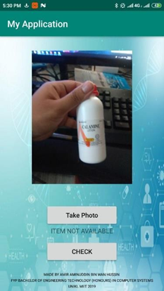

"# MobileAppTensorFlow" 

<h1>Login And Register Page</h1>

user need to login or register using email and password 
the information will be store in firebase

<h1>Main Page</h1>

User will use mobile camera to take picture.

if the image could not recognize by classifier then the result will prompt “ITEM NOT AVAILABLE”

<h1>Result</h1>

If the picture is recognize by classifier it will display the information of the product. 
all the information are store in Firebase to make it realtime database.  
user can use rating star to rate the product and the rating will be send into Firebase to calculate the average of the rating.

